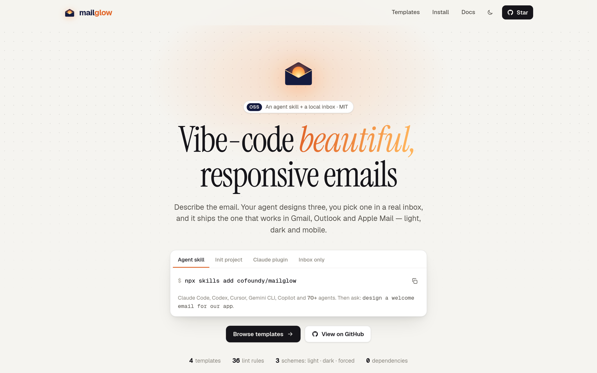
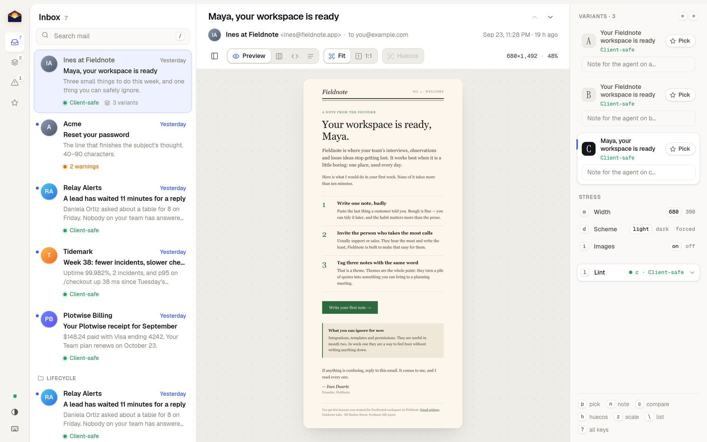
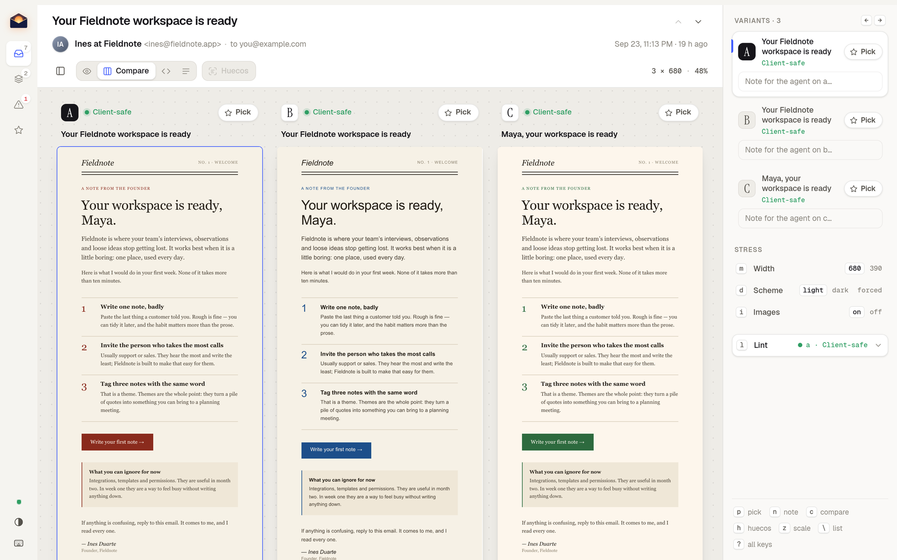
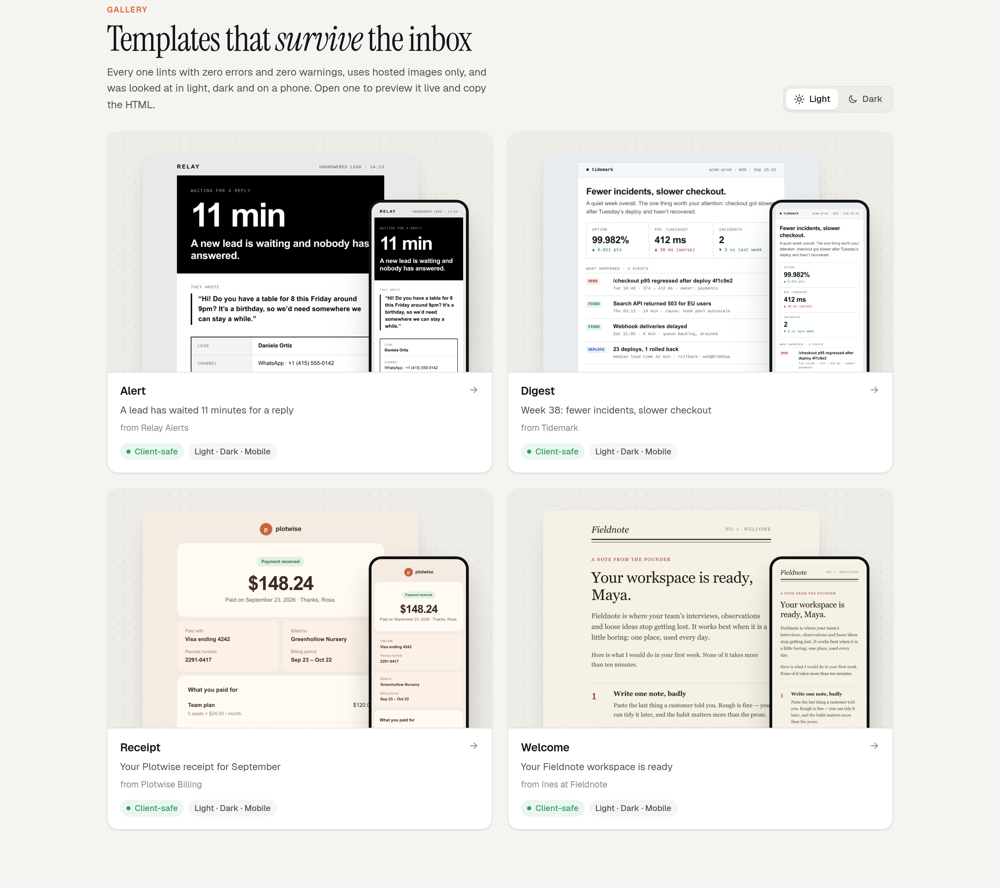
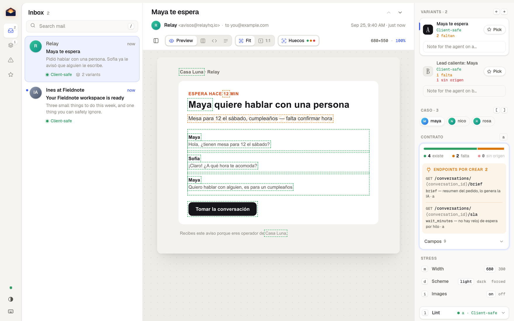

<p align="center">
  <picture>
    <source media="(prefers-color-scheme: dark)" srcset="./assets/logo-dark.png">
    
  </picture>
</p>

<p align="center"><b>Vibe-code beautiful, responsive emails.</b><br>
Describe the email. Your agent designs three, you pick one in a real inbox,<br>
and it ships the one that works in Gmail, Outlook and Apple Mail — light, dark and mobile.</p>

<p align="center">
  
  
  
  
  
  
</p>

<p align="center">
  <picture>
    <source media="(prefers-color-scheme: dark)" srcset="./assets/site-dark.png">
    
  </picture>
</p>

<p align="center">
  <code>npx github:cofoundy/mailglow init</code> &nbsp;·&nbsp; <a href="#template-gallery">Template gallery</a> &nbsp;·&nbsp; <a href="#install">Install</a>
</p>

---

Email is the last UI you design blind. You write HTML, open it in a browser, it looks fine — and then
Outlook stacks it wrong, Gmail clips it, dark mode turns your text invisible, and the logo is a broken
image because it pointed at `./logo.png`.

**mailglow** gives your AI agent the missing half: an inbox to look at.

## What you get

- **A local mini inbox.** Your emails as messages — sender, subject, preheader — and the opened email
  next to them. Desktop or phone, light, dark or *forced* dark (what the Gmail app does to you), images
  on or blocked. Live-reloads while the agent edits.
- **Variants you can actually choose between.** The agent writes three structurally different versions;
  you flip with ← → or see them side by side, press **Pick**, leave a note ("header of B, table of C"). The agent reads your pick
  and notes and does the next round. No more describing a design in chat.
- **A linter that knows mail clients.** Local or `data:` images, `localhost` links, flexbox, CSS
  variables, missing preheader, Gmail's 102 KB clip, no dark-mode styles — each finding names the
  clients it breaks. `--net` checks every hosted image really answers.
- **Screenshots of every email** in every mode, plus a contact sheet, from one command. Good for PRs,
  for a client review, or for finding out what your product has been sending all along.
- **A design skill, not a template dump.** Hierarchy for the inbox row and the first phone screen,
  dark mode done on purpose, bulletproof components, an anti-slop list — and a gallery of examples in
  different directions.

<p align="center">
  <picture>
    <source media="(prefers-color-scheme: dark)" srcset="./assets/inbox-dark.png">
    
  </picture>
</p>

<p align="center"></p>

**Before:** a `.html` file, a browser tab, a test send to yourself, a screenshot from a friend with Outlook.
**After:** `serve`, look, pick, ship — and the proof is a folder of PNGs.

## Install

As an agent skill (Claude Code, Cursor, Codex, Gemini CLI and [70+ agents](https://github.com/vercel-labs/skills)):

```bash
npx skills add cofoundy/mailglow
```

Or copy the skill straight into this project, for every agent it finds (`.claude/skills`,
`.agents/skills` for Codex, Cursor, Gemini CLI and Copilot, …):

```bash
npx github:cofoundy/mailglow init                                  # detect the agents in use
npx github:cofoundy/mailglow init --agents claude,codex,cursor,gemini
npx github:cofoundy/mailglow init --global                         # ~/.claude/skills + ~/.agents/skills
```

Or as a Claude Code plugin:

```text
/plugin marketplace add cofoundy/mailglow
/plugin install mailglow@mailglow
```

Then just ask: *"design a welcome email for our app"*, *"show me how our emails look"*,
*"make the password reset look like the rest of the product"*.

Only want the inbox? It's one Node script with zero dependencies (Node 22+; screenshots use the
Chrome/Chromium/Edge you already have):

```bash
npx github:cofoundy/mailglow serve ./emails --open
```

## Template gallery

Every example ships as a page with a live preview (desktop/mobile, light/dark), **Copy HTML** and its
lint status — each one lints with zero errors and zero warnings. The site is generated from
`skills/mailglow/examples/` by the engine itself, zero dependencies:

```bash
npm run gallery                     # → site/index.html, one page per template, sitemap.xml, robots.txt
node skills/mailglow/scripts/mailglow.mjs gallery ./emails --out site --base https://emails.acme.dev
```

<p align="center"></p>

Point it at your own folder and you get a browsable, shareable catalog of what your product sends.
Want your template in the gallery? See [Add a template](CONTRIBUTING.md#add-a-template).

## How it works

```
  describe ─▶ 3 variants ─▶ inbox (← → pick + notes) ─▶ next round ─▶ winner ─▶ lint + shoot ─▶ port to your code
                 ▲                                          │
                 └──────────── picks.json ◀─────────────────┘
```

A folder is the whole interface:

```
emails/
├── password-reset.html        one message
├── welcome/                   one message, three variants
│   ├── a.html
│   ├── b.html
│   └── c.html
├── manifest.json              optional: subject, from, preheader per slug
└── picks.json                 written by the inbox when you pick
```

Metadata can also live in the email itself: `<meta name="mail:subject" content="…">`, `mail:from`,
`mail:preheader`. Already using React Email, MJML or Maizzle? Compile to HTML into the folder — the
inbox and the linter check what recipients actually receive.

## Commands

| | |
|---|---|
| `serve [dir] [--open] [--port 4555]` | the mini inbox with live reload |
| `lint [dir\|file ...] [--net] [--json]` | client compatibility; exits 1 on any error |
| `shoot [dir] [--views desktop,mobile] [--schemes light,dark,forced]` | PNG per email × mode + the inbox view + `index.html` contact sheet |
| `new <slug> [dir] [--variants 3]` | start from the bulletproof starter |
| `picks [dir]` | what was picked, with notes |
| `rules` | every lint rule and why it exists |
| `gallery [dir] [--out site] [--base URL] [--no-shots]` | static landing + template gallery with SEO pages and a sitemap |
| `init [--agents claude,codex,cursor,gemini] [--global] [--force]` | copy the skill into this project's agent skill folders |

Keys in the inbox: `j`/`k` mail · `←`/`→` variant · `m` mobile · `d` light/dark/forced · `i` images ·
`z` fit ↔ true size (1:1) · `c` compare variants side by side · `h` huecos · `[`/`]` data case · `l` lint · `p` pick · `n` note · `\` hide the list · `?` all shortcuts.
The email is never covered: variants, picks, notes, stress modes and lint live in their own column.

## Capture what your product already sends

Most teams have never seen all their own emails side by side. The skill writes a small dump script that
calls your **real** email builders with realistic data (no sends, no DB), drops them in a folder, and
opens the inbox — so the first redesign starts from what users actually get.
See [`capture-existing.md`](skills/mailglow/references/capture-existing.md).

## Where does each field come from?

A design is only done when every field in it has a source. Write the email as a template
(`{{contact.name}}`, `{{#messages}}…{{/messages}}`), put a `contract.json` next to it that names the
endpoint behind each field, and drop real data shapes in `cases/*.json`:

```
emails/handoff/
├── a.html  b.html          templates with {{fields}}
├── contract.json           field → endpoint + path, status "existe" or "falta"
└── cases/maya.json …       data to render with; [ and ] flip between them
```

Press **`h`** (Huecos) and every field in the email is outlined with its origin: green, the data
exists today; amber, the endpoint still has to be built; red, nobody declared where it comes from.
Hover one to read the endpoint. The **Contrato** card lists the endpoints to build, and each variant
card says how many fields it still lacks, so picking a design also tells you what the backend owes it.
The HTML tab shows the template, or what the current case renders to. Exported HTML never carries the outlines.

<p align="center"></p>

## What's inside

```
skills/mailglow/
├── SKILL.md                 the workflow: brand → capture → variants → pick → refine → ship
├── scripts/mailglow.mjs     the engine (serve · lint · shoot · new · picks · rules · gallery · init)
├── templates/starter.html   table layout, inline CSS, preheader, dark mode, bulletproof button
├── examples/                finished emails in different directions
└── references/              design principles · components · client rules · capture recipe
```

## Credits

Built and dogfooded by [Cofoundy](https://cofoundy.dev) on the notification emails of our own product.
The pick-between-variants loop is inspired by [Impeccable](https://impeccable.style) and Matt Pocock's
[prototype skill](https://github.com/mattpocock/skills); client-support knowledge by
[caniemail.com](https://www.caniemail.com). No code from those projects is included — see `NOTICE`.

## License

MIT © Cofoundy SAC

<sub>html email · email templates · responsive email · email preview · email dark mode · email client compatibility · transactional email design · claude code skill · agent skills · vibe coding</sub>
